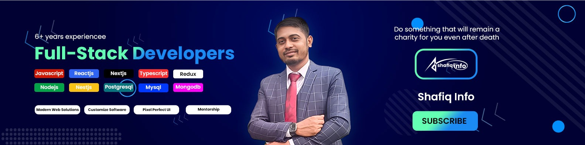

<h1 align="center">👋 Hi, I'm <strong>Md. Shafiqul Islam</strong></h1>
<h3 align="center"> Full Stack Engineer • Tech Educator at Shafiq Info • Menotor </h3>

  📺 YouTube(<a href="https://www.youtube.com/@shafiqdotinfo">Bangla</a>) •
  <a href="https://www.shafiq.info.bd">🌐 Website</a> •
  <a href="https://twitter.com/#">🐦 Twitter</a> •
  <a href="https://linkedin.com/in/shafiq-info">💼 LinkedIn</a>

## 🚀 About Me

I’m **Md. Shafiqul Islam**, widely known as **Shafiq Info**, with 6+ years of proven technical experience as a full-time Software Engineer at ITC PLC. I love building practical, reliable software that solves real-world problems. I enjoy simplifying complex systems through clean code, teaching, and hands-on projects—whether it’s a production application, a tutorial or a course for developers.

I work at the intersection of frontend engineering, backend architecture and developer education, helping teams ship faster, design maintainable systems and grow their technical confidence.

## 🧠 What I Do

 - Teach programming through YouTube, short tutorials, and practical examples.
 - Lead TechQul, an agency delivering high-quality software solutions.
 - Build production-grade systems like Smart Somity using clean architecture.
 - Explore AI tools, developer productivity workflows and automation.
 - Conduct workshops on JavaScript, React and full-stack best practices.
 - Mentor beginner developers and guide career progression.
 - Advocate for testing, debugging, optimization and maintainable code design.
 - Share insights on engineering, leadership and real-life dev experiences.

## 🏢 Founder of TechQul**

A personal engineering initiative where I build products, collaborate with clients, and share educational content. I maintain this alongside my full-time role at ITC PLC.

- AI product development  
- Website design and development
- UX design & research
- Developer upskilling & tech training

🌐 **Website:** https://techqul.com

## 📚 My Journey as an Educator

I actually **started my career as a teacher**, so teaching has always been a natural passion for me. I love helping people understand complex topics in a simple, practical way.

Over the years, I’ve taught **multiple MERN stack batches**, guiding students through real-world projects and helping them build strong foundations in web development.

Alongside this, I run a YouTube channel called Shafiq Info, where I publish educational videos on programming, software engineering, and practical development tips.

👉 Check it out: https://www.youtube.com/@shafiqdotinfo

### 🌱 Why I Share What I Learn
philosophy: learn, practice and present.
Whatever I learn, I try to share with others so they can grow with me.

- Teach with clarity  
- Use real life examples  
- Sharing insights from industry experience 
- Help developers learn faster and smarter  

I strongly believe:

> **“May what I learn and build keep helping others after I'm gone”**

## 🧰 Skills & Tools

- **Frontend:** React, Next.js, TailwindCSS  
- **Backend:** Node.js, Nest.js, PHP, Laravel, Python
- **Database** Mysql, PostgreSQL, Mongodb
- **AI** LLM API, RAG, Agentic AI, Web Automation, Web Scraping  
- **Languages:** JavaScript, TypeScript
- **Tools & Deployment:** Git, Github Action, Docker, AWS S3, VPS 
- **Design:** Figma, UX Principles  

## 📝 Latest Content & Writing

I regularly share engineering content around:

- JavaScript performance  
- React patterns  
- Testing & debugging  
- AI concepts & terminologies  
- Career growth for developers  

You can explore more at: **https://www.shafiq.info.bd/articles**

## 💬 Let's Connect

If you’re looking to build modern web solutions or grow as a developer, let’s connect — and build something great together, Insha’Allah.

📧 Email: shafiqinfo.dev@gmail.com  
🌐 Website: https://www.shafiq.info.bd  
💼 LinkedIn: https://linkedin.com/in/shafiq-info

