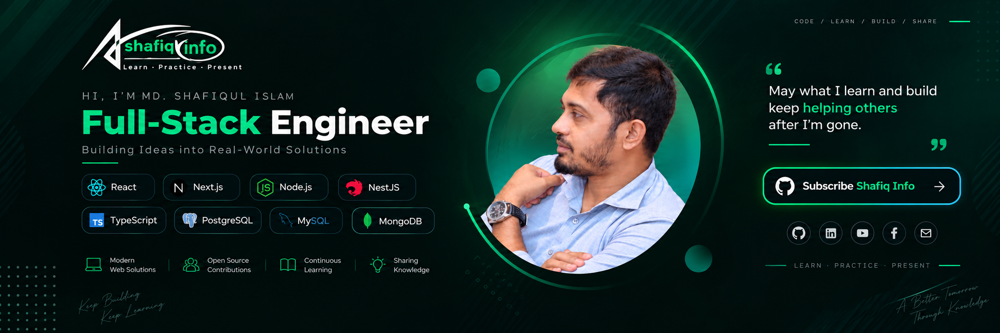

<h1 align="center">👋 Hi, I'm <strong>Md. Shafiqul Islam</strong></h1>
<h3 align="center"> Full-Stack Software Engineer | React, Next.js, Node.js, NestJS | AI & Software Engineering </h3>

  📺 YouTube(<a href="https://www.youtube.com/@shafiqdotinfo">Bangla</a>) •
  <a href="https://www.shafiq.info.bd">🌐 Website</a> •
  <a href="https://linkedin.com/in/shafiq-info">💼 LinkedIn</a>

## 🚀 About Me

I’m **Md. Shafiqul Islam**, widely known as **Shafiq Info**, with 6+ years of proven technical experience as a full-time Software Engineer at ITC PLC. I love building practical, reliable software that solves real-world problems. I enjoy simplifying complex systems through clean code, teaching, and hands-on projects—whether it’s a production application, a tutorial or a course for developers.

I work at the intersection of frontend engineering, backend architecture and developer education, helping teams ship faster, design maintainable systems and grow their technical confidence.

## 🧠 What I Do

- 🚀 Build scalable full-stack web applications
- 🏢 Develop custom business & management software
- 🤖 Integrate AI into modern applications and workflows
- 🧩 Design APIs, backend systems and databases
- 🏗️ Work on system architecture and technical solutions
- 👨‍🏫 Mentor developers and create technical content

## 🚀 Founder of TechQul

I lead **TechQul**, a software development initiative focused on building practical digital solutions for businesses and clients.

### Focus Areas
- Full-stack web development
- Business & management software
- AI-powered solutions
- UI/UX implementation
- Developer mentoring & training

🌐 Website: https://techqul.com

## 🎓 My Journey as an Educator

I started my professional journey as an **ICT Teacher**, where I discovered my passion for programming and helping others understand technology.

Today, I continue that journey through **Shafiq Info**, where I share practical content about programming, software engineering, AI, and modern development practices.

👉 Check it out: https://www.youtube.com/@shafiqdotinfo

## 🌱 Why I Share

I believe technology becomes more valuable when knowledge is shared.

- Teach with clarity
- Share real-world experience
- Build practical examples
- Help developers learn faster

I strongly believe:

> **“May what I learn and build keep helping others after I'm gone”**

## 🛠️ Skills & Tools

**Frontend**
React, Next.js, TypeScript, JavaScript, Tailwind CSS

**Backend**
Node.js, NestJS, Laravel, REST APIs

**Database**
PostgreSQL, MySQL, MongoDB, Redis

**Cloud & DevOps**
Docker, GitHub Actions, AWS, VPS, Nginx

**AI**
LLM APIs, RAG, AI Agents, AI Coding Tools

**Tools**
Git, GitHub, Postman, Swagger

**Design**
Figma, UI/UX Principles

## ✍️ Latest Content

I regularly write about:

- JavaScript & React
- Next.js & Full-Stack Development
- Backend & Database Engineering
- AI & AI-Native Development
- Testing, Debugging & System Design
- Developer Career & Learning

You can explore more at: **https://www.shafiq.info.bd/articles**

## 💬 Let's Connect

If you’re looking to build modern web solutions or grow as a developer, let’s connect — and build something great together, Insha’Allah.

📧 Email: shafiqinfo.dev@gmail.com  
🌐 Website: https://www.shafiq.info.bd  
💼 LinkedIn: https://linkedin.com/in/shafiq-info

